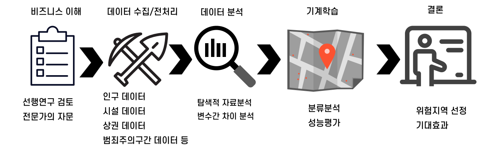
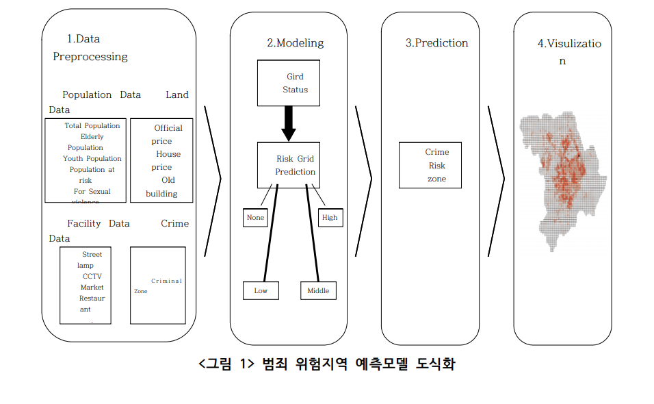
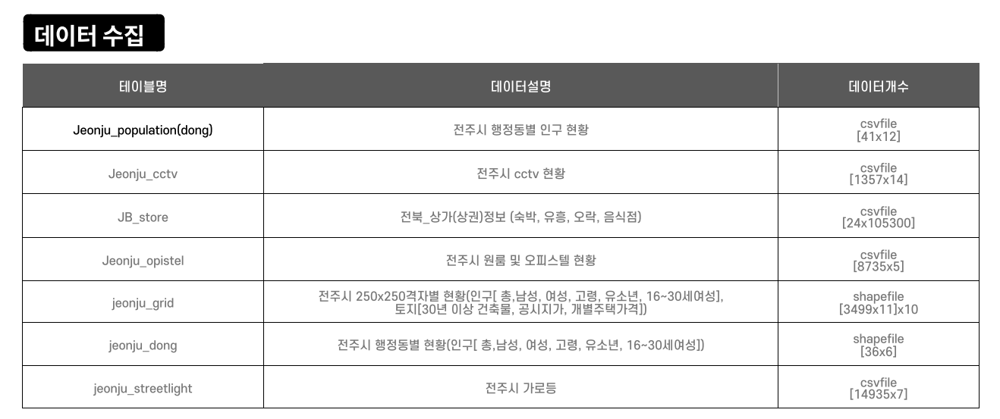
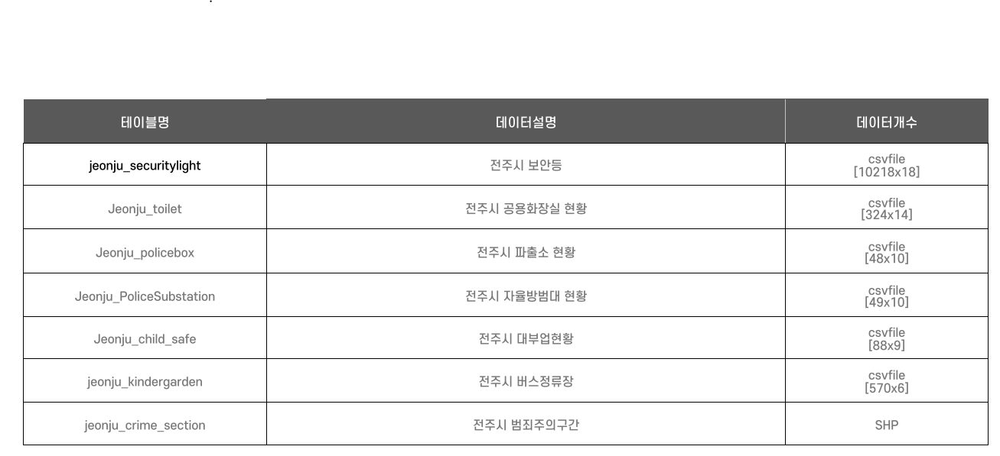
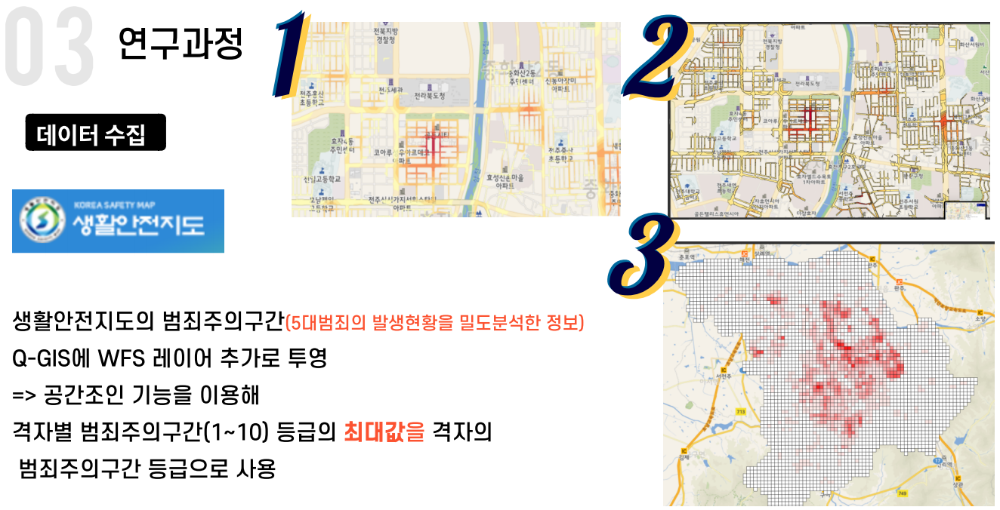
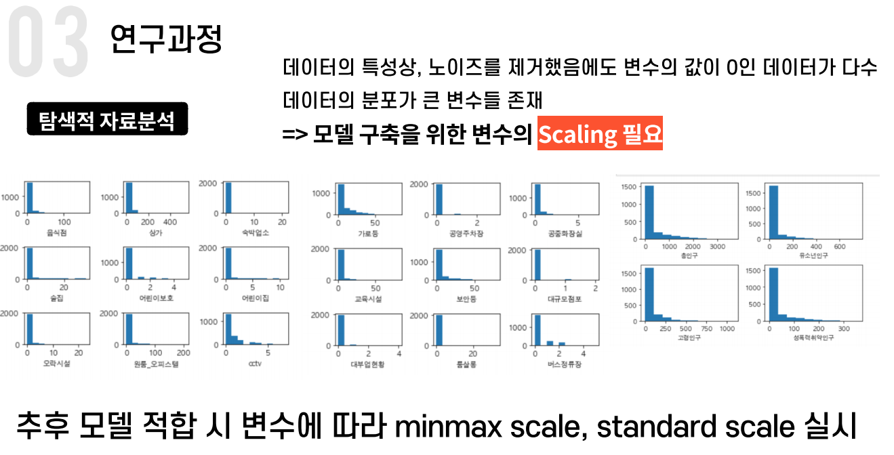
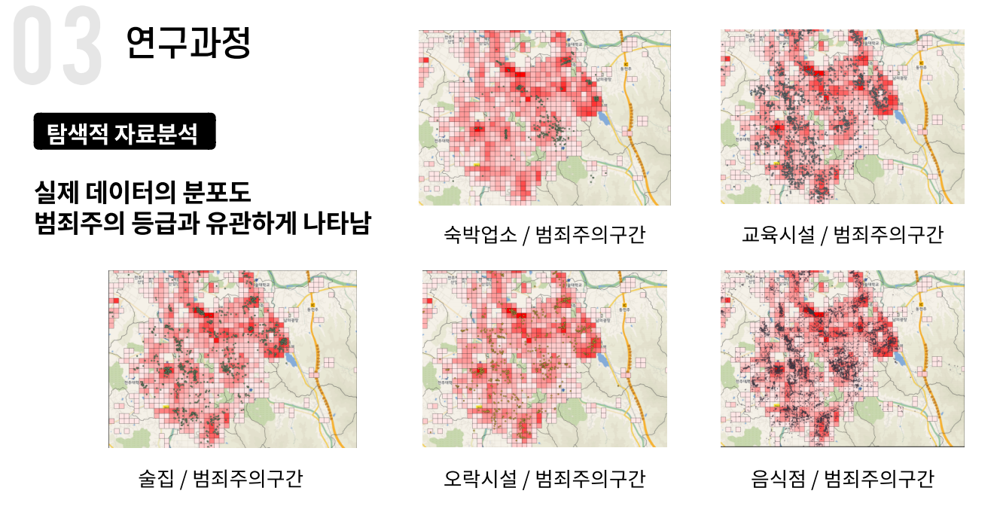
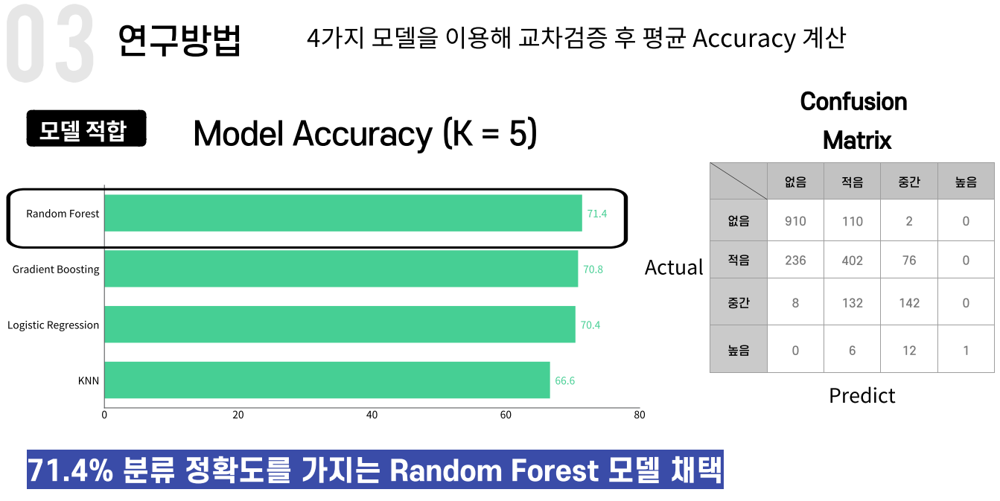
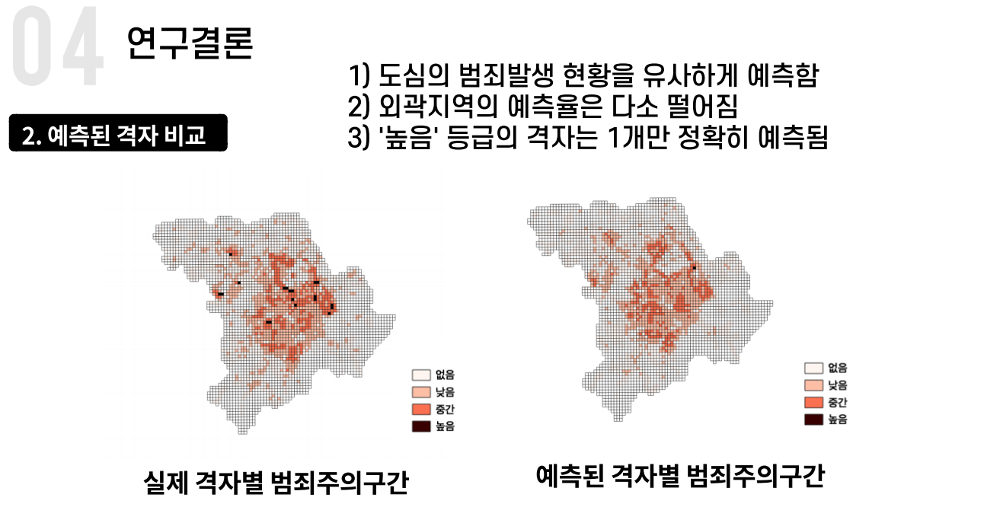

## 공공데이터를 활용한 범죄 위험지역 분석 프로젝트

### - 전주시를 중심으로 -

### 기획 배경

- 시간의 흐름에 따라 전국 범죄발생건수는 점차 감소하는 추세를 보이나, 사회적 약자를 대상으로 한 범죄는 점차 증가
- 통계청 2018 사회조사에 따르면 야간 보행에 두려운 곳이 있다는 응답이 36.5% 차지

- 공간 및 지역특성을 포함한 공간 빅데이터를 활용하여 지역을 분석하면 범죄 예방 전략을 마련할 수 있음
- **범죄 예방적 차원에서 사람들이 거주하는 도시 공간의 환경 특성을 기반으로 범죄 발생공간을 예측하고자 시도한 한국의 연구는 매우 미흡**

### 프로젝트 목표

- 전주시 범죄 발생지역 분석 및 영향 요인 파악
- 전주시 범죄 위험 격자에 대한 시설물 제안

### 진행 프로세스

### 활용 데이터

### EDA

### 연구결과

### 연구 결론

#### 차별성

- 주택 가격, 노후 건축물 등 선행연구 대비 다양한 변수 사용
- 연구범위를 (250x250) 격자로 설정해 세밀한 분석
- 전주시에서 이뤄지지 않았던 공간데이터 활용 범죄 위험 구역 예측 시도

#### 한계점

- 격자를 이용해 세밀한 분석이 가능했으나, 미세한 구간 차이로 일부 데이터가 오분류
- 정확한 범죄 발생량 및 위치 데이터 수집의 한계
- 유의미한 변수라 판단했던, 유동인구, 1인가구 비율 등 데이터 수집의 한계
- 최종 선택된 모델의 예측 결과 범죄 발생률이 높은 격자에 대한 예측력이 높지 않음

### 연구 의의

- 범죄 발생구역에 대한 예측력 71.4%로 다소 높은 수준이므로 분석 결과를 기반으로 순찰로 설정 가능
- 관공서와 협의를 통해 범죄에 유관한 데이터 및 범죄 발생 데이터를 구축할 경우 설명력 높은 모델 구현 가능
- 모델 성능 개선을 통해 타 지역에서도 범죄 발생구역 예측에 대한 표준 분석 모델로 이용 가능 